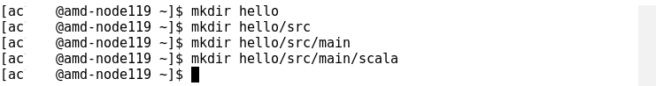
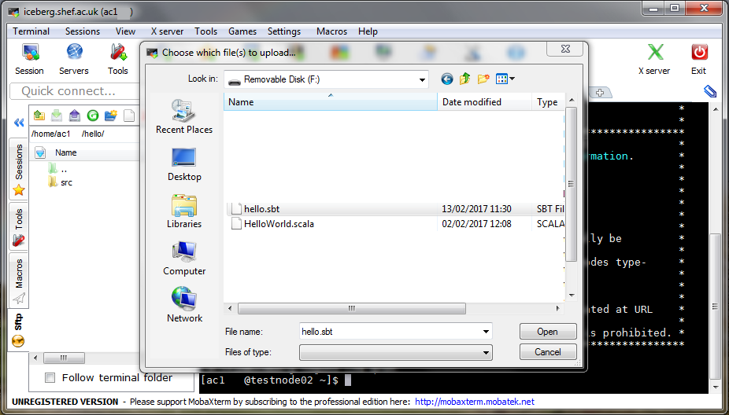
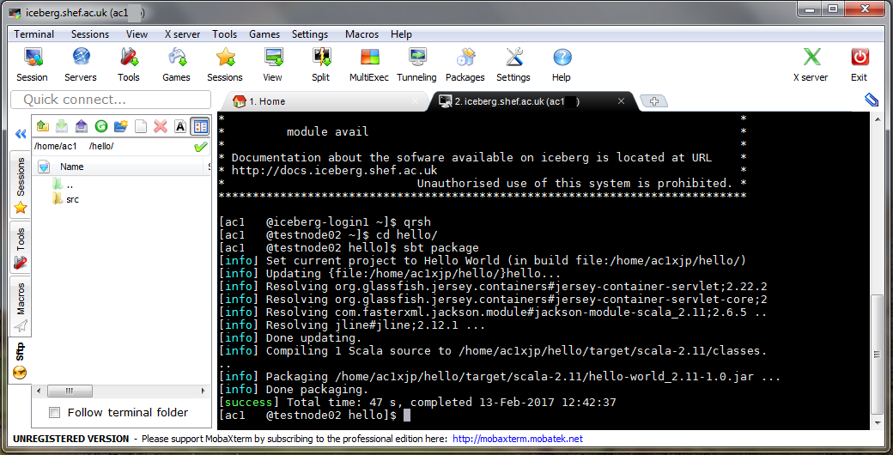
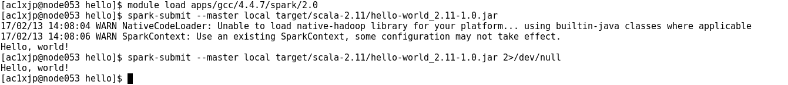

# Using the High Performance Computing (HPC) systems at Sheffield

## Presentation

The presentation given during the session is at https://mikecroucher.github.io/Intro_to_HPC/#/

## Description of Sheffield's HPC Systems

The University of Sheffield has two HPC systems:-

* [Sharc](http://docs.hpc.shef.ac.uk/en/latest/sharc/) Sheffield's newest system. It contains about 2000 CPU cores all of which are latest generation.
* [Iceberg](http://docs.hpc.shef.ac.uk/en/latest/iceberg/) Iceberg is Sheffield's old system. It contains 3440 CPU cores but many of them are very old and slow.

The two systems are broadly similar but have small differences in the way you load applications using the module system.

**We recommend that you use Sharc as much as possible.**

## Connecting to the HPC systems from Windows

### Exercise 1: Install MobaXterm

To use the HPC from a Windows machine, you need a way to connect - we recommend you install  `mobaXterm`.
This is available from [http://mobaxterm.mobatek.net](http://mobaxterm.mobatek.net).
On a University machine, you need to install the `portable` version (highlighted in the image below):

The download is a zip file that contains three other files. You should **Extract these files**, for example to your desktop, before you use them.
Do not run MobaXterm directly from the zip file.

`mobaXterm` also contains `mobaTextEditor` which you can use to write your programs.

### Exercise 2: Log in to Sharc

You can connect to `Sharc` using `mobaXterm` as shown in the screenshot below.
The `Remote Host` field should contain `sharc.sheffield.ac.uk`:

If your log-in is successful, you should see something like the screen below.

To run a <tt>scala</tt> program on a Linux machine, it will need to be compiled using the [Scala build tool](http://www.scala-sbt.org/). This requires a very strict directory structure <b>and</b> a <tt>.sbt</tt> file specifying dependencies. We illustrate this on the <tt>helloWorld</tt> example.

<h4>Create the directory structure</h4>

1. Start by creating the project directory at the top (<tt>~</tt>) level. We call this <tt>hello</tt> in this case.
2. Then create the directory structure required by <tt>sbt</tt>

You can control directory creation via the <tt>mobaXterm</tt> session:

or you can do everything via the command line by typing the following:

Either way, you need to create the above 4 embedded directories.

<h4>Create <tt>.sbt</tt> file and <tt>.scala</tt> file on the Windows machine</h4>

The <tt>.sbt</tt> file contains the dependencies required by the program. Take a look at the <tt>.sbt</tt> file included [here](files/hello.sbt) for the <tt>helloWorld</tt> program. The <tt>.scala</tt> program is also [available](files/HelloWorld.scala).

<h4>Copy the <tt>.sbt</tt> file over to the HPC</h4>

The <tt>.sbt</tt> file needs to be placed at the top level of the project.

<h4>Copy the <tt>.scala</tt> file over to the HPC</h4>

The <tt>.scala</tt> file needs to be placed in the <tt>scala</tt> directory.

<h4>Compile the project</h4>

<h4>Import spark and run program</h4>

