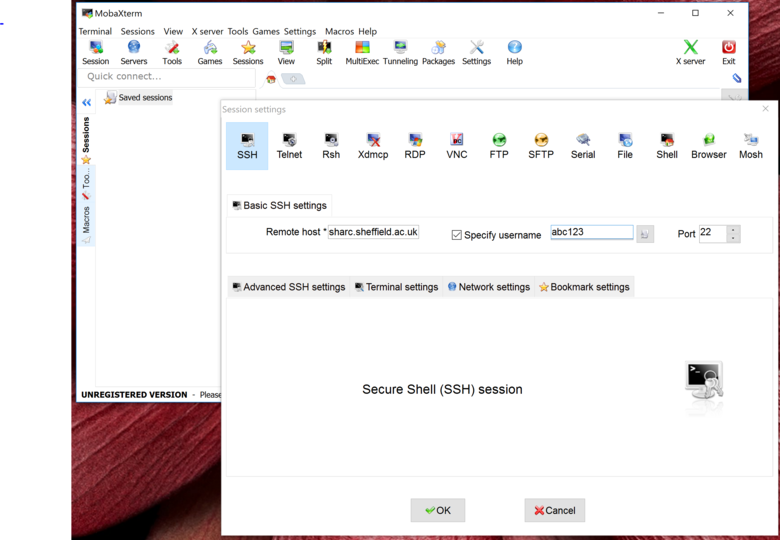
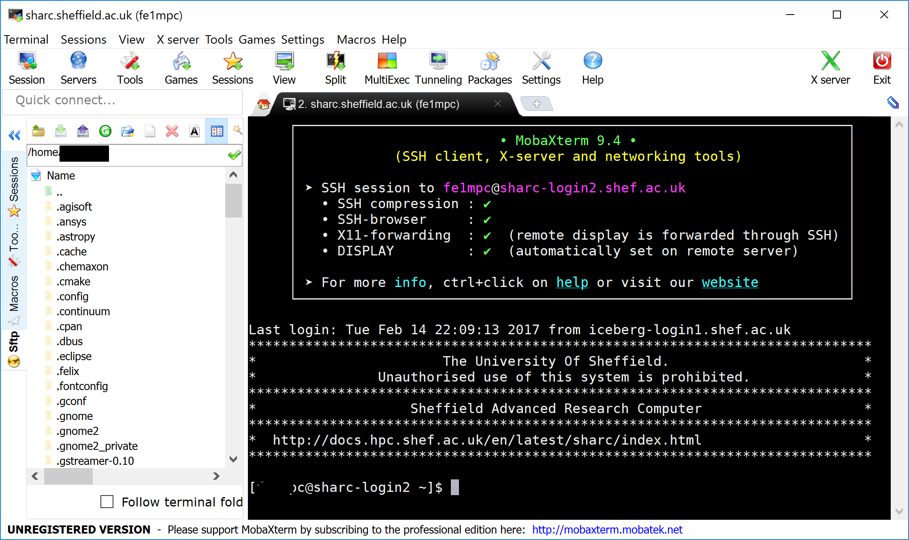
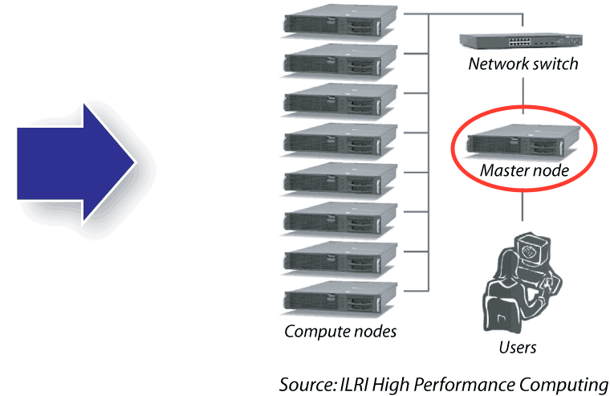
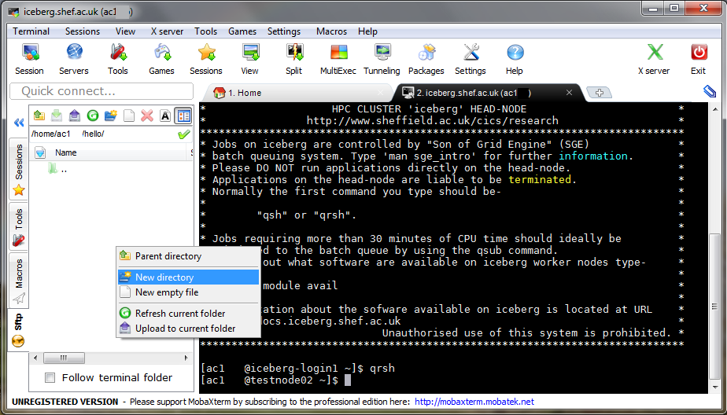
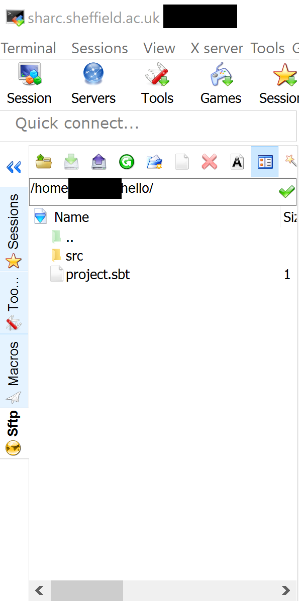

# Using the High Performance Computing (HPC) systems at Sheffield

## Presentation

The presentation given during the session is at https://mikecroucher.github.io/Intro_to_HPC/#/

## Description of Sheffield's HPC Systems

The University of Sheffield has two HPC systems:-

* [Sharc](http://docs.hpc.shef.ac.uk/en/latest/sharc/) Sheffield's newest system. It contains about 2000 CPU cores all of which are latest generation.
* [Iceberg](http://docs.hpc.shef.ac.uk/en/latest/iceberg/) Iceberg is Sheffield's old system. It contains 3440 CPU cores but many of them are very old and slow.

The two systems are broadly similar but have small differences in the way you load applications using the module system.

**We recommend that you use Sharc as much as possible.**

## Connecting to the HPC systems from Windows

### Exercise 1: Install MobaXterm

To use the HPC from a Windows machine, you need a way to connect - we recommend you install  `mobaXterm`.
This is available from [http://mobaxterm.mobatek.net](http://mobaxterm.mobatek.net).
On a University machine, you need to install the `portable` version (highlighted in the image below):


The download is a zip file that contains three other files. You should **Extract these files**, for example to your desktop, before you use them.
Do not run MobaXterm directly from the zip file.

`mobaXterm` also contains `mobaTextEditor` which you can use to write your programs.

### Exercise 2: Log in to Sharc

You can connect to `Sharc` using `mobaXterm` as shown in the screenshot below.
The `Remote Host` field should contain `sharc.sheffield.ac.uk`:



If your log-in is successful, you should see something like the screen below.



At this point, you are on the `log in` or `Master node` of Sharc. There isn't much compute power here and many people use it simultaneously. As such, we should get onto a compute node as fast as possible.



### Exercise 3: Start an interactive session on a compute node.

Since Sharc is a shared system, used by 100s of users, we need to request some resources from the `scheduler` using the command `qrshx`. We need to tell the system how much memory we want to use.

For example, to request 8 Gigabytes (8G) of memory, we would enter

`qrshx -l rmem=8G`

**Note: the `l` is a small letter `L` not the number `1`**

If this command is successful, you should see the prompt change from `sharc-login1` or  `sharc-login-2` to `sharc-nodeXXX` where XXX will be replaced with the number of the node you have been assigned.


You are now on a compute node and have access to your own CPU core and 8 Gigabytes of RAM.

Now would be a good time to learn some Linux commands using our [Mini Terminal Tutorial](terminal_tutorial.md)

### Exercise 4: Download Scala/Spark 'Hello World' (one we made earlier)

To run a `scala` program on a Linux machine, it will need to be compiled using the [Scala build tool](http://www.scala-sbt.org/). This requires a very strict directory structure *and* a `.sbt` file specifying dependencies. We illustrate this on the `helloWorld` example.

On the compute node, download a prepared `Hello World` application from GitHub with the command

`git clone https://github.com/mikecroucher/scala-spark-HelloWorld`

Enter the directory containing the code with the command

`cd scala-spark-HelloWorld/
`

List the files in this directory with the Linux command `ls`

```
ls
```

Should give the output

```
project.sbt  README.md  src
```

Take a look at the contents of `project.sbt`, which defines our project, with the Linux command `more`

```
more project.sbt
```

Should give the output

```
name := "hello"
version := "1.0"
scalaVersion := "2.11.8"
libraryDependencies ++= Seq(
    "org.apache.spark" %% "spark-core" % "2.0.1",
    "org.apache.spark" %% "spark-sql" % "2.0.1"
)
// Could add other dependencies here e.g.
// libraryDependencies += "org.apache.spark" %% "spark-mllib" % "2.0.1"
```

The `project.sbt` defines how our project will be compiled.
The code that is to be compiled is hidden a few directories deeper.

View it using the `more` command

```
more src/main/scala/hello.scala
```

Which should give the output

```
import org.apache.spark.sql.SparkSession
// define main method (scala entry point)
object HelloWorld {
  def main(args: Array[String]): Unit = {

    // initialise spark session (running in "local" mode)
    val sparkSession = SparkSession.builder
      .master("local")
      .appName("Hello World")
       .getOrCreate()

    // do stuff
    println("Hello, world!")

    // terminate underlying spark context
    sparkSession.stop()
  }
}
```

### Exercise 5: Compile and run HelloWorld

We've downloaded a project, taken a look at it and all seems well. We are almost ready to compile.

The command we need to use is `sbt package` but when we try it, it doesn't work:

```
sbt package
```

results in

```
bash: sbt: command not found
```

This error message occurs because the `sbt` command is not available to us by default when we start a `qrshx` session on a compute node.

To make `sbt` available (and Java and Spark which we also need), We first have to load the relevant `module files`

```
module load apps/java/jdk1.8.0_102/binary
module load dev/sbt/0.13.13
module load apps/spark/2.1.0/gcc-4.8.5
```

Now, when you type `sbt package`, it will compile your program.

If this is successful, you'll have a file in the location `target/scala-2.11/hello_2.11-1.0.jar`.

Run with

```
spark-submit --master local[1] target/scala-2.11/hello_2.11-1.0.jar
```

You will see _warnings_ like:

```
WARN: Unable to load native-hadoop library
```

These can be ignored.

### Exercise 6: Manually create the directory structure

We'll now learn how to create HelloWorld from scratch to give us practice in using Linux commands.

**Make sure you are home**

Ensure you are in your home directory by executing the command `cd` on its own. Check that you are where you expect to be using the `pwd` (print working directory) command.

The result should be

`/home/abc123`

where `abc123` will be replaced by your username.

**Create the directory structure

Start by creating the project directory. We'll call this `hello` in this case.

To create our directory, we could use the graphical user interface of MobaXterm as shown in the screen shot below



It's much easier, however, to use the `mkdir` command

`mkdir hello`

we could then proceed to create the other directories we need one command at a time:

```
mkdir hello/src
mkdir hello/src/main
mkdir hello/src/main/scala
```

Alternatively, we could take a shortcut and the `-p switch` of `mkdir` to create the whole nested structure at once.

```
mkidr -p hello/src/main/scala
```

Linux geeks are terminally lazy so if it feels like there should be a shortcut, there probably is one

However you do it, you need to create the above 4 embedded directories.

**Create the .sbt and .scala files**

Here, we create <tt>.sbt</tt> file and <tt>.scala</tt> file on the Windows machine(By downloading them or by copying and pasting them using an editor) and then transfer them to Sharc.

Recall that the <tt>.sbt</tt> file contains the dependencies required by the program. Take a look at the <tt>.sbt</tt> file included [here](files/project.sbt) for the <tt>helloWorld</tt> program. The <tt>.scala</tt> program is also [available](files/hello.scala).

**Copy the <tt>.sbt</tt> file over to Sharc**

The <tt>.sbt</tt> file needs to be placed at the top level of the project.
You can just drag and drop it from Windows to Sharc using MobaXterm.



**Copy the <tt>.scala</tt> file over to the HPC**

The <tt>.scala</tt> file needs to be placed in the <tt>scala</tt> directory.

**Compile and run the project**

Exactly as before, we compile and run with  `sbt package`.

If this is successful, you'll have a file in the location `target/scala-2.11/hello_2.11-1.0.jar`.

Run with

```
spark-submit --master local[1] target/scala-2.11/hello_2.11-1.0.jar
```

### Exercise 7: Run a program in batch mode

Running short jobs, such as compiling our scala code or running `Hello World` is fine in interactive `qrshx` sessions.
However, when we want to run long jobs or request resources such as multiple CPUs, we should start using **batch processing**.

Let's get an example from GitHub that calculates Pi using a monte carlo algorithm.

```
git clone https://github.com/mikecroucher/scala-spark-MontePi
```

Compile it as usual

```
cd scala-spark-MontePi/
sbt package
```

Instead of running it interactively, we are going to submit it to the scheduler queue.
The example includes a `job submission script` called `submit_to_sharc.sh`

Look at this file using the `more` command to see if you can understand it.
When you are ready, submit it to the queue with the `qsub` command

```
qsub submit_to_sharc.sh

Your job 83909 ("submit_to_sharc.sh") has been submitted
```

You can see the status of the job with the `qstat` command.

```
qstat

job-ID  prior   name       user         state submit/start at     queue                          slots ja-task-ID
-----------------------------------------------------------------------------------------------------------------
  81304 0.42776 bash       ab1abc       r     02/14/2017 23:53:29 interactive.q@sharc-node001.sh     1
  83909 0.00000 submit_to_ ab1abc       qw    02/15/2017 03:22:23  `
```

`qsub` and `qstat` are examples of **scheduler commands**.
A list of them can be found on the [HPC documentation website](http://docs.hpc.shef.ac.uk/en/latest/hpc/scheduler/index.html)

**Where did the output go?**

When the job has completed, you will see two new files in your current directory.
In my case, they were `submit_to_sharc.sh.e83909`  and `submit_to_sharc.sh.o83909`.
The number at the end refers to the `job-ID`

Look at these two files with the `more command`

* The file that ends with `.e83909` contains the standard error stream (stderr)
* The file that ends with `.o83909` contains the standard output stream (stdout)

Refer to the Wikipedia article on [Standard streams](https://en.wikipedia.org/wiki/Standard_streams) for more information in this terminology.

**Requesting a LOT of memory**

If you need to request a lot of memory for your job - for example 50Gigabytes per core, add the following lines to your job submission script.

```
# Tell the sysytem to make use of the project containing the big memory nodes
#$ -P rse
# Ask for 50 Gigabytes per core
#$ -l rmem=50G
```
